# Hi, I'm Rahul 👋

DevOps / Platform / Infrastructure Engineer with 5+ years of experience building and
operating cloud-native platforms across AWS, GCP and Kubernetes.

My work sits at the intersection of infrastructure, platform engineering and software
engineering — designing reliable production systems, automating operational workflows,
improving observability, and building internal platforms and tooling that help
engineering teams operate at scale. At Brightcove, I work on infrastructure supporting
high-traffic global live streaming, including multi-CDN systems that have supported
10M+ concurrent viewers during major events.

🔹 Kubernetes on AWS EKS & GCP GKE — Helm, RBAC, GitOps with Argo CD  
🔹 Cloud infrastructure & production operations across AWS and GCP  
🔹 Observability & reliability — Prometheus, Datadog, OpenTelemetry, Jaeger, CloudWatch, PagerDuty  
🔹 Infrastructure as code & CI/CD — Terraform, GitOps workflows  
🔹 Platform tooling & automation in Go and Python  
🔹 AI-powered operational tooling — Python, FastAPI, LLM frameworks for incident investigation and root-cause analysis  

I approach infrastructure as a software engineering problem — building platforms and
automation rather than relying on manual operations. Open to DevOps, Platform
Engineering, Infrastructure, Cloud Platform and AI Platform opportunities.

---

## 📫 Contact

LinkedIn  
https://linkedin.com/in/rahulbalajee

Email  
rahulbalajee.97@gmail.com

---

## 📊 GitHub Stats

